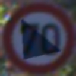
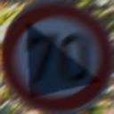

# Adversarial Shadow Attack on Traffic Sign Sequences

This project introduces a **non-differentiable adversarial shadow attack** designed to target **traffic sign recognition models** over entire **image sequences**. Leveraging a **Genetic Algorithm (GA)**, the attack strategically overlays realistic shadow patterns that evolve over time—mimicking the appearance of cast shadows in dynamic driving scenarios.

### 🔍 Key Features

- **Sequence-Level Attack:** Operates over temporally ordered image sequences, simulating how a sign is seen from different distances.
- **Shadow Generator:** Applies photorealistic shadow perturbations using parametric masks (polygon or triangle) in LAB color space.
- **Temporal Consistency:** A single shadow shape and opacity is applied across the sequence with gradual spatial scaling to mimic real-world dynamics.
- **Multi-Objective Loss:** Jointly optimizes classification confidence and attention consistency using ViT attention maps from DINO.
- **Black-Box Optimization:** Uses a genetic algorithm to evolve adversarial shadow parameters without access to model gradients.

### 📦 Components

- `main.py`: Orchestrates the end-to-end attack pipeline.
- `shadow_attack.py`: Implements the GA-based shadow optimization logic.
- `shadow_generator.py`: Generates physically plausible shadow masks.
- `GTSRBClassifier.py`: Loads and evaluates the GTSRB CNN classifier.
- `dino_attention.py`: Extracts DINO ViT attention maps.
- `compute_l2_shadow_diff.py`: Calculates L2 distance between clean and adversarial images for stealthiness evaluation.

### 📊 Evaluation

- **Attack Success Rate (ASR):** Measures misclassification over sequences.
- **Attention Shift (MSE):** Quantifies deviation from original attention maps.
- **L2 Distance:** Assesses perceptual difference between clean and shadowed images.

### 📁 Dataset

- Based on [GTSRB](https://benchmark.ini.rub.de/gtsrb_news.html), preprocessed into sequences of 30 RGB frames per traffic sign, with tight bounding box crops.

---

### 🖼️ Adversarial Shadow Sequence Example

Below is a sample adversarial sequence from the GTSRB dataset. All 30 frames were perturbed using the same shadow mask with temporal scaling. **29 out of 30 frames were misclassified as class `7` (100 km/h speed limit), while the true label is class `4` (70 km/h speed limit).**

<figure>
  

    
    
    
    
    
     
    
    
    
    
    
     
    
    
    
    
    
     
    
    
    
    
    
     
    
    
    
    
    
    
  

  <figcaption align="center">
    <strong>Figure:</strong> Adversarial shadow attack on a 70 km/h sign sequence. The classifier is misled into predicting 100 km/h for 29 out of 30 frames.
  </figcaption>
</figure>
